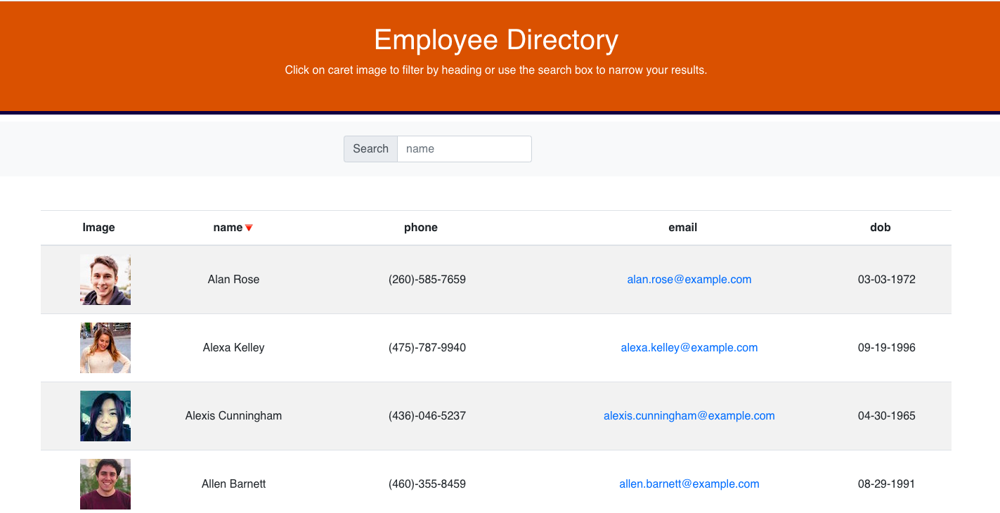

# Employee Directory

## Overview

It's an employee directory project created with React. 

## User Story

* As a user, I want to be able to view my entire employee directory at once so that I have quick access to their information.

## Business Context

An employee or manager would benefit greatly from being able to view non-sensitive data about other employees. It would be particularly helpful to be able to filter employees by name.

## Description

When the user loads the page, a table of employees will be displayed. 

The user is able to:

  * Sort the table by clicking the caret next to table heading

  * Search for particular employee information by typying in searchbox.

## API
  * Reference the [Random User API](https://randomuser.me/api/?results=200&nat=us) for generating users
  
## Employee Directory

## Links

* the URL to the deployed application:

* the URL to the Github repository: https://github.com/Ranjini2020/Employee-Directory

